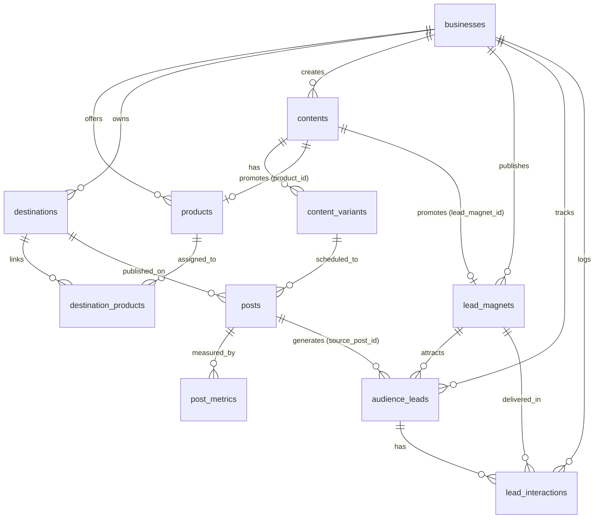

# Content Desk & Audience CRM Architecture

## 1. System Overview

**Content Desk** is an integrated Personal Brand, Content Production, Product Catalog, Lead Magnet Delivery, and Lightweight CRM system built for creators and agency founders focusing on AI automation, AI agents, n8n, GoHighLevel (GHL), voice AI, and business automation workflows.

The system powers a **comment-driven inbound growth engine** across 5 primary social channels:
- LinkedIn
- Instagram
- X / Twitter
- Facebook Profile / Pages
- Facebook Groups

Audiences interact with posts by commenting dedicated keywords (e.g. `IDEAS`, `GHL`, `BLUEPRINT`, `AGENT`, `AUDIT`, `DEMO`), triggering manual or semi-automated DM fulfillment, lead capture, qualification (potential client identification), and pipeline follow-up.

---

## 2. Core Entities & Data Architecture

### 2.1 Tables
- **`businesses`**: Brand/agency entity scoped to the owner user (`owner_id = auth.uid()`). Supports archiving via `archived_at`.
- **`products`**: Products and services offered by businesses (`kind`: `product` / `service`).
- **`destinations`**: Social media profiles, pages, and groups across Facebook, Instagram, LinkedIn, TikTok, and X. Tracks access tokens and token validity.
- **`destination_products`**: Optional link between destinations (e.g. specific Facebook or LinkedIn groups) and specific products.
- **`contents`**: Central idea, draft, script, and offer library.
  - Links to `product_id` and `lead_magnet_id`.
  - `cta_keyword`: Uppercase comment trigger keyword (e.g., `AGENT`, `GHL`).
  - `comment_prompt`: Exact CTA copy (e.g., *"Comment AGENT to get my complete n8n workflow blueprint"*).
  - `growth_goal`: Goal categorization (`lead_generation`, `audience_growth`, `authority`, `client_conversion`).
- **`content_variants`**: Platform-specific adaptations of content (captions, platform hooks, hashtags).
- **`posts`**: Actual scheduling and publication records with links and publication dates.
- **`post_metrics`**: Cumulative metric snapshots (`reach`, `views`, `likes`, `comments`, `keyword_comments`, `dm_count`, `resource_requests`, `profile_visits`, `new_followers`, `inquiries`, `qualified_leads`, `orders`, `revenue`, `spend`).
- **`assets`**: File attachments stored in Supabase Storage (`content-media`).
- **`lead_magnets`**: Free resources, checklists, prompt packs, templates, or GitHub repos offered in exchange for comments/DMs.
- **`audience_leads`**: People who commented keywords or sent DMs. Tracks handle, profile URL, contact details, potential client flag, and status (`new`, `contacted`, `qualified`, `unqualified`, `converted`, `archived`).
- **`lead_interactions`**: Delivery log of resources sent, interaction types, channels, and follow-ups.

---

## 3. Navigation & Views

1. **Overview (`overview`)**:
   - High-level KPIs: Total Content, Published Posts, Audience Leads, Potential Clients.
   - Secondary CRM Bar: Active Lead Magnets, Resources Sent, Remaining Posts, Ready Content.
   - Recent Content & Lead Magnet funnel snapshot.
2. **Content Library (`library`)**:
   - Content repository filterable by business, product, platform, format, and status.
   - Detail sheet with tabs: Content, Lead Funnel, Versions, Files, Post History.
3. **Post Tracker (`posts`)**:
   - Multi-platform post scheduling and publication tracking.
   - 1-click shortcut to add a lead directly from a published post.
4. **Lead Magnets (`lead_magnets`)**:
   - Free assets, trigger keywords, resource URLs, and funnel stages.
   - Connected content volume and total leads acquired per lead magnet.
5. **Audience & CRM (`crm`)**:
   - Leads list with potential client highlights, platform links, and 1-click resource delivery toggle.
   - Interaction log tracking comments, keyword usage, resource fulfillment, and follow-up reminders.
6. **Calendar (`calendar`)**:
   - Dhaka-time visual month calendar of scheduled and published posts.
7. **Performance (`analytics`)**:
   - Cumulative post metrics with sorting on reach, views, keyword comments, DMs, and inquiries.
8. **Products & Services (`products`)**:
   - Catalog management for offers and services.
9. **Group Directory (`groups`)**:
   - Management and CSV import for Facebook and LinkedIn communities.
10. **Settings (`settings`)**:
    - Business configuration and social destination credentials / token health monitoring.

---

## 4. Credentials and Automation
Vault-backed secure storage via `05-social-credentials.sql`. RPCs `list_social_credentials`, `save_social_credential`, and `remove_social_credential` protect secrets with RLS policies. Stored values are password-masked and never exposed back in plain text to client interfaces.

---

## 5. Migration History

| Script | Purpose | Status |
|---|---|---|
| `database/01-schema.sql` | Core schema (`businesses`, `destinations`, `contents`, `content_variants`, `posts`, `post_metrics`, `assets`) | Applied |
| `database/05-social-credentials.sql` | Encrypted credentials and Vault RPCs | Applied |
| `database/06-products-businesses.sql` | `products` table and business archiving | Applied |
| `database/07-group-products-content-fields.sql` | `destination_products` and enriched content fields | Applied |
| `database/11-group-platform-visibility.sql` | Group platform visibility and LinkedIn group support | Applied |
| `database/12-lead-magnets-audience-crm.sql` | Adds `lead_magnets`, `audience_leads`, `lead_interactions`, content CTA fields, and comment metrics | Applied |
