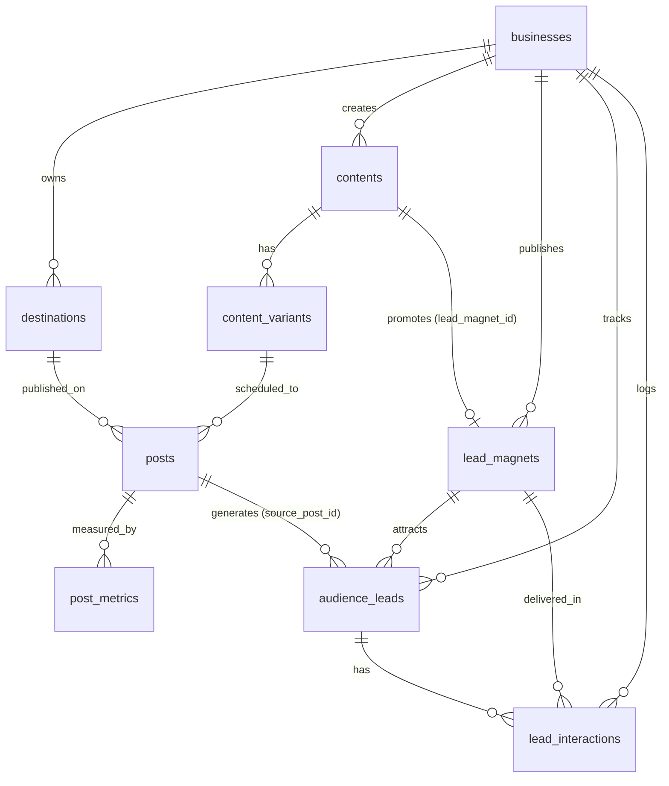

# Content Desk & Audience CRM Architecture

## 1. System Overview

**Content Desk** is an integrated Personal Brand, Content Production, Lead Magnet Delivery, and Lightweight CRM system built for creators and agency founders focusing on AI automation, AI agents, n8n, GoHighLevel (GHL), voice AI, and business automation workflows.

The system powers a **comment-driven inbound growth engine** across 5 primary social channels:
- LinkedIn
- Instagram
- X / Twitter
- Facebook Profile / Pages
- Facebook Groups

Audiences interact with posts by commenting dedicated keywords (e.g. `IDEAS`, `GHL`, `BLUEPRINT`, `AGENT`, `AUDIT`, `DEMO`), triggering manual or semi-automated DM fulfillment, lead capture, qualification (potential client identification), and pipeline follow-up.

---

## 2. Core Entities & Data Architecture



### 2.1 Existing Core Tables
- **`businesses`**: Brand/agency entity scoped to the owner user (`owner_id = auth.uid()`).
- **`destinations`**: Social media profiles, pages, and groups across Facebook, Instagram, LinkedIn, TikTok, and X. Tracks access tokens and token validity.
- **`contents`**: Central idea, draft, script, and offer library.
  - **V1 Additions**:
    - `lead_magnet_id`: Links content to a primary lead magnet asset.
    - `cta_keyword`: Uppercase comment trigger keyword (e.g., `AGENT`, `GHL`).
    - `comment_prompt`: Exact CTA copy (e.g., *"Comment AGENT to get my complete n8n workflow blueprint"*).
    - `growth_goal`: Goal categorization (`lead_generation`, `audience_growth`, `authority`, `client_conversion`).
- **`content_variants`**: Platform-specific adaptations of content (captions, platform hooks, hashtags).
- **`posts`**: Actual scheduling and publication records with links and publication dates.
- **`post_metrics`**: Point-in-time cumulative metric snapshots.
  - **V1 Additions**:
    - `profile_visits`: Profile views driven by the post.
    - `new_followers`: Follower gains attributed to the post.
    - `dm_count`: Inbound direct messages started.
    - `keyword_comments`: Comments containing the designated keyword.
    - `resource_requests`: Explicit requests for the lead magnet asset.
- **`assets`**: File attachments stored in Supabase Storage (`content-media`).

### 2.2 Growth & CRM Tables (V1)
1. **`lead_magnets`**:
   - `id`: UUID Primary Key.
   - `business_id`: Cascades on business deletion.
   - `name`: Display name of the free resource.
   - `slug`: Unique slug per business.
   - `description`: Value proposition and outline.
   - `type`: `pdf`, `github_repo`, `google_doc`, `notion_doc`, `checklist`, `prompt_pack`, `template`, `video_demo`, `other`.
   - `resource_url`: Direct link to file/repo/doc (`https://...`).
   - `cta_keyword`: Uppercase trigger keyword (unique per business).
   - `target_audience`: Ideal audience profile.
   - `funnel_stage`: `awareness`, `interest`, `consideration`, `conversion`.
   - `status`: `draft`, `active`, `paused`, `archived`.

2. **`audience_leads`**:
   - `id`: UUID Primary Key.
   - `business_id`: Scoped to owner.
   - `full_name`: Lead's name.
   - `handle`: Social username / handle (e.g., `@handle`).
   - `platform`: `linkedin`, `instagram`, `x`, `facebook`, `other`.
   - `profile_url`: Direct URL to lead profile.
   - `email`, `phone`: Contact details if collected.
   - `lead_status`: `new`, `contacted`, `qualified`, `unqualified`, `converted`, `archived`.
   - `potential_client`: Boolean flag for high-intent potential consulting/agency clients.
   - `source_post_id`: Reference to the post where the lead engaged.
   - `lead_magnet_id`: Reference to the lead magnet the lead requested.
   - `notes`: Qualification notes and engagement context.

3. **`lead_interactions`**:
   - `id`: UUID Primary Key.
   - `business_id`: Scoped to owner.
   - `lead_id`: Reference to `audience_leads`.
   - `post_id`: Reference to `posts`.
   - `lead_magnet_id`: Reference to `lead_magnets`.
   - `channel`: `comment`, `dm`, `email`, `call`, `other`.
   - `interaction_type`: `keyword_comment`, `inquiry`, `dm_sent`, `resource_sent`, `call_booked`, `feedback`, `other`.
   - `keyword_used`: Specific keyword used by the lead.
   - `resource_sent`: Boolean tracking whether the link/asset was delivered.
   - `resource_sent_at`: Timestamp of asset delivery.
   - `follow_up_status`: `none`, `needed`, `in_progress`, `completed`, `closed`.
   - `follow_up_at`: Scheduled follow-up timestamp.
   - `notes`: Interaction conversation log.

---

## 3. Security & Access Model

- **Row-Level Security (RLS)**:
  - Enabled on all tables.
  - Policies enforce owner isolation:
    ```sql
    exists (
      select 1 from public.businesses b
      where b.id = business_id and b.owner_id = (select auth.uid())
    )
    ```
- **Permission Grants**:
  - `anon`: Revoked on all sensitive data tables. PostgREST allows authenticated requests only.
  - `authenticated`: Granted `select`, `insert`, `update`, `delete`.
- **Credential Protection**:
  - Service-role keys and database passwords are **never** bundled or exposed in frontend client code.
  - Supabase client initialization in [`lib/supabase.ts`](file:///c:/codex/2026-09-08/sho/content-desk/lib/supabase.ts) uses only the public project URL and publishable key.

---

## 4. UI Architecture & View Hierarchy

- **Framework**: React 19 + Vite/Vinext with Shadcn UI styled primitives.
- **Entry Points**:
  - [`app/page.tsx`](file:///c:/codex/2026-09-08/sho/content-desk/app/page.tsx): Authentication gate (email/password login).
  - [`app/workspace.tsx`](file:///c:/codex/2026-09-08/sho/content-desk/app/workspace.tsx): Main application dashboard managing reactive state and views.
  - [`app/editor.tsx`](file:///c:/codex/2026-09-08/sho/content-desk/app/editor.tsx): Unified modal CRUD editor for all entities.
  - [`lib/content.ts`](file:///c:/codex/2026-09-08/sho/content-desk/lib/content.ts): Data dictionary, labels, timezone helpers (`Asia/Dhaka`), token health checkers, and filtering functions.

### Views:
1. **Overview (`overview`)**:
   - Content and publication KPIs.
   - Audience Growth summary: Total Leads, High-Intent Potential Clients, Resources Delivered, Active Lead Magnets.
   - Pipeline progress meters and upcoming scheduled posts.
2. **Content Library (`library`)**:
   - Filterable content inventory displaying linked Lead Magnets, CTA Keywords, formats, and statuses.
   - Detail sheet with dedicated "লিড ফানেল" (Lead Funnel) tab displaying lead magnet details and comment prompt copy button.
3. **Post Tracker (`posts`)**:
   - Platform posts with schedule dates, published URLs, and quick 1-click "লিড যোগ করো" button to log leads originating from that post.
4. **Lead Magnets (`lead_magnets`)**:
   - Management hub for free assets, trigger keywords, and funnel stages.
   - Tracks connected content volume and total leads acquired per lead magnet.
5. **Audience & CRM (`crm`)**:
   - Lead table with potential client stars, platform handles, and 1-click resource delivery toggling.
   - Interaction log tracking comments, keyword usage, resource fulfillment, and follow-ups.
6. **Calendar (`calendar`)**:
   - Dhaka-time visual month calendar of scheduled and published posts.
7. **Performance (`analytics`)**:
   - Cumulative metrics breakdown with sorting on keyword comments, DMs, and resource requests.
8. **Settings (`settings`)**:
   - Business profiles and destination account token health monitoring.

---

## 5. Migration History

| Script | Purpose | Status |
|---|---|---|
| `outputs/01-schema.sql` | Initial core schema (`businesses`, `destinations`, `contents`, `content_variants`, `posts`, `post_metrics`, `assets`) | Applied |
| `database/12-lead-magnets-audience-crm.sql` | Adds `lead_magnets`, `audience_leads`, `lead_interactions`, content CTA fields, and comment metrics | Applied |
