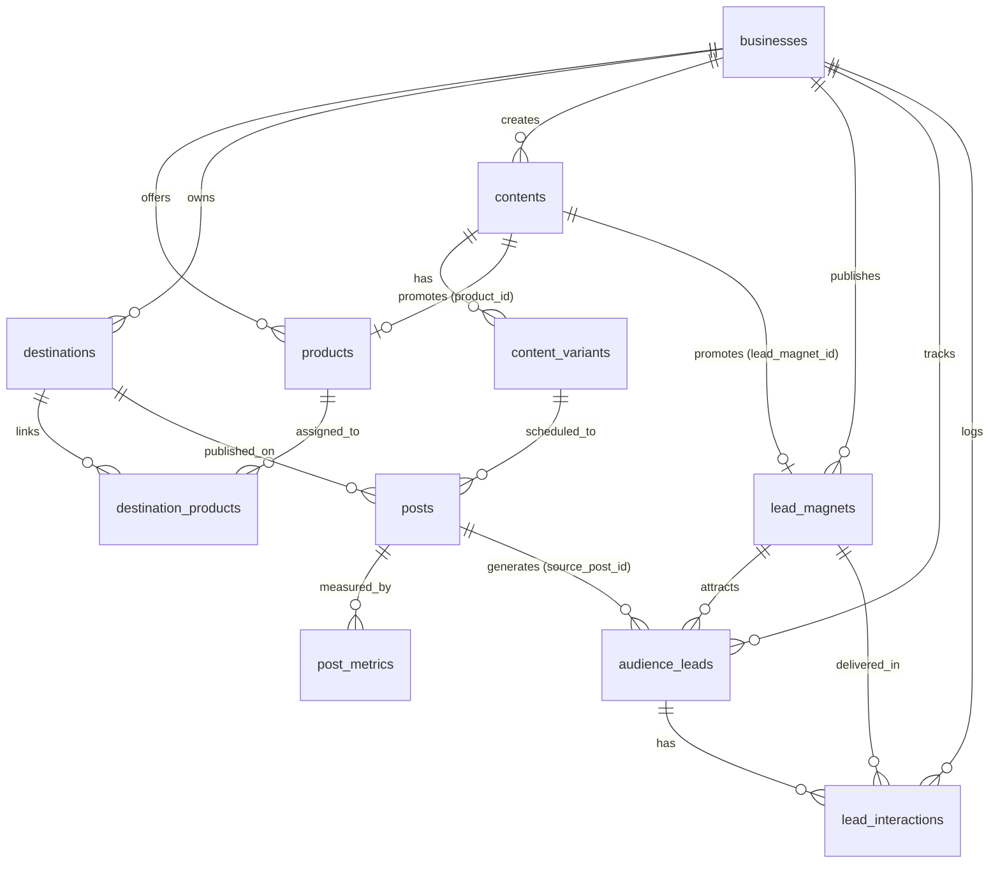

# Content Desk & Audience CRM Architecture

## 1. System Overview

**Content Desk** is an integrated Personal Brand, Content Production, Product Catalog, Lead Magnet Delivery, and Lightweight CRM system built for creators and agency founders focusing on AI automation, AI agents, n8n, GoHighLevel (GHL), voice AI, and business automation workflows.

The system powers a **comment-driven inbound growth engine** across 5 primary social channels:
- LinkedIn
- Instagram
- X / Twitter
- Facebook Profile / Pages
- Facebook Groups

Audiences interact with posts by commenting dedicated keywords (e.g. `IDEAS`, `GHL`, `BLUEPRINT`, `AGENT`, `AUDIT`, `DEMO`), triggering manual or semi-automated DM fulfillment, lead capture, qualification (potential client identification), and pipeline follow-up.

---

## 2. Core Entities & Data Architecture

### 2.1 Tables
- **`businesses`**: Brand/agency entity scoped to the owner user (`owner_id = auth.uid()`). Supports archiving via `archived_at`.
- **`products`**: Products and services offered by businesses (`kind`: `product` / `service`).
- **`destinations`**: Social media profiles, pages, and groups across Facebook, Instagram, LinkedIn, TikTok, and X. Tracks access tokens and token validity.
- **`destination_products`**: Optional link between destinations (e.g. specific Facebook or LinkedIn groups) and specific products.
- **`contents`**: Central idea, draft, script, and offer library.
  - Links to `product_id` and `lead_magnet_id`.
  - `cta_keyword`: Uppercase comment trigger keyword (e.g., `AGENT`, `GHL`).
  - `comment_prompt`: Exact CTA copy (e.g., *"Comment AGENT to get my complete n8n workflow blueprint"*).
  - `growth_goal`: Goal categorization (`lead_generation`, `audience_growth`, `authority`, `client_conversion`).
- **`content_variants`**: Platform-specific adaptations of content (captions, platform hooks, hashtags).
- **`posts`**: Actual scheduling and publication records with links and publication dates.
- **`post_metrics`**: Cumulative metric snapshots (`reach`, `views`, `likes`, `comments`, `keyword_comments`, `dm_count`, `resource_requests`, `profile_visits`, `new_followers`, `inquiries`, `qualified_leads`, `orders`, `revenue`, `spend`).
- **`assets`**: File attachments stored in Supabase Storage (`content-media`).
- **`lead_magnets`**: Free resources, checklists, prompt packs, templates, or GitHub repos offered in exchange for comments/DMs.
- **`audience_leads`**: People who commented keywords or sent DMs. Tracks handle, profile URL, contact details, potential client flag, and status (`new`, `contacted`, `qualified`, `unqualified`, `converted`, `archived`).
- **`lead_interactions`**: Delivery log of resources sent, interaction types, channels, and follow-ups.

---

## 3. Navigation & Views

1. **Overview (`overview`)**:
   - High-level KPIs: Total Content, Published Posts, Audience Leads, Potential Clients.
   - Secondary CRM Bar: Active Lead Magnets, Resources Sent, Remaining Posts, Ready Content.
   - Recent Content & Lead Magnet funnel snapshot.
2. **Content Library (`library`)**:
   - Content repository filterable by business, product, platform, format, and status.
   - Detail sheet with tabs: Content, Lead Funnel, Versions, Files, Post History.
3. **Post Tracker (`posts`)**:
   - Multi-platform post scheduling and publication tracking.
   - Bulk selection, bulk delete, and single delete with cascade cleanup of associated `post_metrics` snapshots.
   - Quick recency scope filters: 'আজকের পোস্ট' (Today in Dhaka time with glowing badge), 'নতুন ও সাম্প্রতিক (৭ দিন)' (last 7 days), and 'সব পোস্ট' (all posts), ensuring today's and new posts are immediately accessible without manual date pickers.
   - 1-click shortcut to add a lead directly from a published post.
4. **Lead Magnets (`lead_magnets`)**:
   - Free assets, trigger keywords, resource URLs, and funnel stages.
   - Connected content volume and total leads acquired per lead magnet.
5. **Audience & CRM (`crm`)**:
   - Leads list with potential client highlights, platform links, and 1-click resource delivery toggle.
   - Interaction log tracking comments, keyword usage, resource fulfillment, and follow-up reminders.
6. **Calendar (`calendar`)**:
   - Dhaka-time visual month calendar of scheduled and published posts.
7. **Performance (`analytics`)**:
   - Cumulative post metrics with sorting on reach, views, keyword comments, DMs, and inquiries.
8. **Products & Services (`products`)**:
   - Catalog management for offers and services.
9. **Group Directory (`groups`)**:
   - Management and CSV import for Facebook and LinkedIn communities.
10. **Settings (`settings`)**:
    - Business configuration and social destination credentials / token health monitoring.

---

## 4. Credentials and Automation
Vault-backed secure storage via `05-social-credentials.sql`. RPCs `list_social_credentials`, `save_social_credential`, and `remove_social_credential` protect secrets with RLS policies. Stored values are password-masked and never exposed back in plain text to client interfaces.

---

## 5. Migration History

| Script | Purpose | Status |
|---|---|---|
| `database/01-schema.sql` | Core schema (`businesses`, `destinations`, `contents`, `content_variants`, `posts`, `post_metrics`, `assets`) | Applied |
| `database/05-social-credentials.sql` | Encrypted credentials and Vault RPCs | Applied |
| `database/06-products-businesses.sql` | `products` table and business archiving | Applied |
| `database/07-group-products-content-fields.sql` | `destination_products` and enriched content fields | Applied |
| `database/11-group-platform-visibility.sql` | Group platform visibility and LinkedIn group support | Applied |
| `database/12-lead-magnets-audience-crm.sql` | Adds `lead_magnets`, `audience_leads`, `lead_interactions`, content CTA fields, and comment metrics | Applied |
| `database/13-reset-ai-automation.sql` | Resets/wipes all content and configures AI Automation & Personal Branding | Available for execution |

---

## 6. Build & Deployment Architecture

- **Engine & Build Script**: The project uses `vinext` on Vite. Static production distribution is handled by `scripts/build.mjs` (invoked via `npm run build`), which executes `vinext build --prerender-all`.
- **Static Artifact Aggregation**: Static pre-rendered route files (`dist/server/prerendered-routes/index.html` and `404.html`) and client JS/CSS bundles (`dist/client/*`) are mapped directly into root `dist/`.
- **Vercel Hosting**: Configured via `vercel.json` with output directory `dist` and single-page application (SPA) rewrites to `/index.html`.
- **Verification & Runtime Limits**: All core views, authentication, and database operations run client-side against Supabase. Server-side API endpoints on Vercel without a Node/Edge adapter are not supported in this static distribution mode.

## 7. Group Platform & Filtering Extension
Migration 11 adds `destinations.visibility` (public/private/unknown), default unknown, and expands the group platform check to Facebook/LinkedIn. Existing `approval_required` remains independent of visibility. CSV recognizes platform from normalized hostname, validates optional platform column, and reads visibility and `approval_required` with form defaults. LinkedIn URLs use numeric `/groups/` IDs. Duplicate matching uses full normalized URL including host. Groups view filters business, product (including business-only), platform, visibility, approval and active state. SQL 11 must run before saving groups with the new payload.

## 8. Single-Day Focus, One-Click Publishing & Business Classification
1. **Single-Day Workspace Scoping**: By default, `filters.dateMode` is `'single'` and defaults to the current day in Asia/Dhaka time. The Daily Control Bar (`.daily-bar`) provides previous/next day stepping, an inline HTML5 date picker, an instant "Back to Today" shortcut, and daily progress chips (contents, posted, remaining). All content-related views (Overview, Content Library, Post Tracker, Analytics) filter to the active day without mixing multiple days together. In Post Calendar, clicking any active day cell switches directly to that day's Content Library in single-day mode. Users can switch to `'all'` mode via the daily mode toggle if a broader view is needed.
2. **One-Click "Mark as Posted"**: Content Library rows and the Content Detail sheet feature an instant `[পোস্ট সম্পন্ন]` button. Clicking it automatically ensures an associated platform variant (defaulting to Facebook / primary text) and active destination exist, creates or updates the post record with `status = 'published'`, `published_at = now()`, and a valid destination/platform URL (satisfying database publication constraints), and switches to a green `[পোস্ট হয়েছে]` toggle pill. Clicking an already published pill toggles the post back to planned/draft.
3. **Content & Lead Magnet Deletion & Batch Reset**: Both individual content rows, lead magnets, and CRM leads feature delete actions protected by confirmation dialogs. A batch `[সব কনটেন্ট ও লিড ম্যাগনেট মুছুন]` action is available in Settings, and `[সব ম্যাগনেট মুছুন]` is available in the Lead Magnets panel. Deletions strictly execute in cascade-safe dependency order (`lead_interactions` -> `audience_leads` -> `post_metrics` -> `posts` -> `assets` -> `content_variants` -> `contents` -> `lead_magnets`) scoped to the authenticated user's active businesses, eliminating foreign key violation errors.
4. **Physical / Digital Service Classification**: Replaces rigid ecommerce/agency terminology across the UI. Businesses and products are classified into `ডিজিটাল সার্ভিস (Digital Service)` (mapped internally to `agency` / `service` to preserve DB check constraints) and `ফিজিক্যাল (Physical)` (mapped to `ecom` / `product`). A filter for `businessKind` (`all`, `digital_service`, `physical`) is integrated into the workspace filter panel and settings.
5. **AI Automation & Personal Branding Setup**: `setupAiAutomation()` in `app/workspace.tsx` and `database/13-reset-ai-automation.sql` provide a one-click setup configuring the user's primary business as "AI Automation" (`agency` / Digital Service) and primary product as "Personal Branding" (`service`), archiving other unneeded records to keep the workspace clutter-free.
6. **Material Limitations**: Database tables enforce `check (kind in ('ecom', 'agency'))` on businesses and `check (kind in ('product', 'service'))` on products; UI terminology transparently bridges these to Digital Service and Physical without breaking unmigrated live database schemas. Live database content wiping requires either using the authenticated in-app reset buttons or executing `13-reset-ai-automation.sql` within the Supabase dashboard SQL editor.
